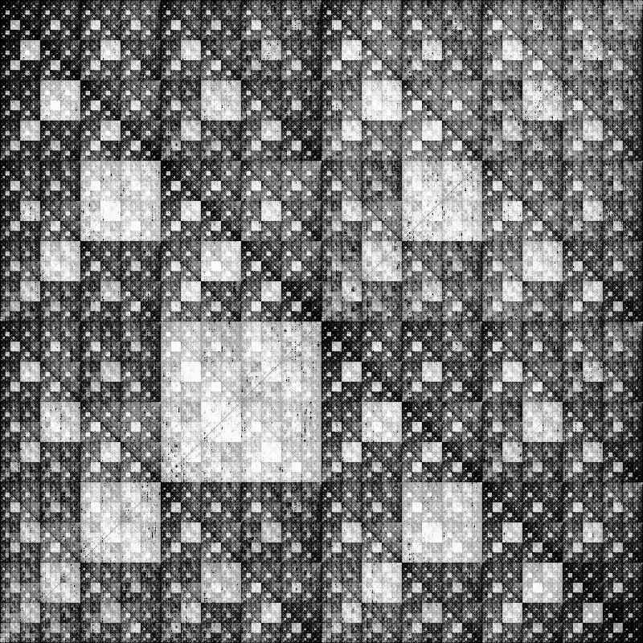
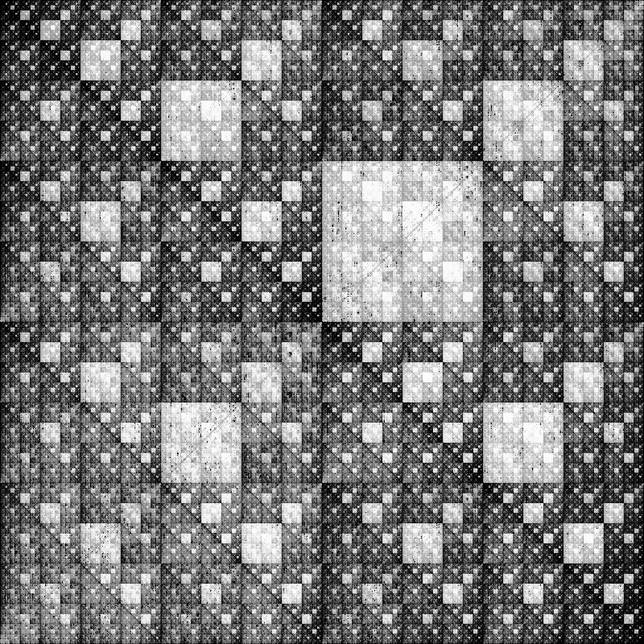

# Visualize Chaos Game Representation of GRCh37

This project attempts to visualize the chaos game representation (CGR) of the human reference genome [GRCh37](https://www.ncbi.nlm.nih.gov/assembly/GCF_000001405.13/).

Both the forward and backward CGRs of GRCh37 was previously computed in [this repository](https://github.com/jeyabbalas/chaos-game-representation). The resulting coordinates were stored in a public Google Cloud Storage bucket: gs://chaos-game-representation-grch37/.

In this repository, I use these precalculated coordinates to rasterize the CGR image. The resulting images generated are shown below. Note that all 3 billion bases in GRCh37 is represented in this image.

## GRCH37 Forward CGR (5'-3')

## GRCH37 Backward CGR (3'-5')

